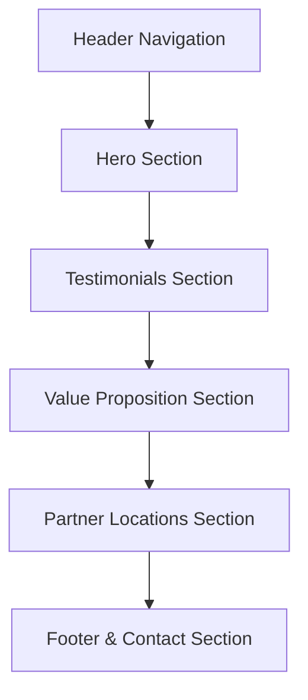

# Rebuild Blueprint: ARO Holistics

This document provides a complete visual, structured, and content blueprint of the [ARO Holistics](https://aroholistics.com/) website. It is designed to serve as the perfect context and reference file for rebuilding a modern, premium, and fully-featured website.

---

## 1. Brand Identity & Visual Vibe

* **Aesthetic Vibe**: Botanical, organic, clean, wellness-focused, and premium/clinical.
* **Core Theme**: A boutique cold-pressed juicery combining natural wellness with science-backed nutrition.
* **Current Issues in Existing Site**: It is built on a LeadConnector/funnel-builder infrastructure and feels incomplete, containing noticeable placeholder content (e.g., standard "Lorem Ipsum" customer testimonials).

---

## 2. Design System & Style Guide

### Color Palette

| Usage | Color Name | Visual Representation / Hex Value | Design Purpose |
| :--- | :--- | :--- | :--- |
| **Primary Accent** | Dark Forest Green | `#1B3B2B` | Branding, main headings, primary call-to-action buttons, card borders. Conveys health, nature, and clinical authority. |
| **Secondary Accent** | Mid-tone Sage Green | `#2E5A44` | Subtle borders, hover states, sub-elements. |
| **Light Background** | Sage/Cream | `#F4F7F4` | Soft, natural off-white background used to reduce eye strain (e.g., in Hero and Location cards). |
| **Alt Background** | Pure White | `#FFFFFF` | Used to distinguish sections (e.g., Value Proposition section). |
| **Text (Body)** | Charcoal | `#222222` | High-contrast readability for paragraphs and descriptions. |
| **Text (Inverse)** | Pure White | `#FFFFFF` | Text inside primary buttons and footer containers. |

### Typography

* **Headings (H1, H2, H3)**: Elegant Serif Font (e.g., *Cormorant Garamond*, *Playfair Display*, or *Lora*). Used to convey trust, quality, and premium brand values.
* **Body, UI, & Buttons**: Modern, highly readable Sans-Serif Font (e.g., *Inter*, *Montserrat*, or *Outfit*).

---

## 3. Site Structure (Information Architecture)

The current site is a single-page landing funnel. Below is the layout sequence and component architecture:

### Layout Sections

#### A. Header
* **Logo**: Branding emblem on the left.
* **Navigation Links**: Anchor scroll links (e.g., "About Us", "Locations").
* **CTA Button**: SMS initiator containing the brand phone number: `(915) 255-8624`.

#### B. Hero Section
* **Visuals**: Earthy background image/color featuring botanical imagery or fresh juice bottles.
* **Headlines**:
  * Title: `🌿 ARO Holistics`
  * Subtitle: `Holistic Cold Pressed Juicery`
* **CTA Button**: `"What Nutrients Does Your Body Crave? Find Out Here"` (Links to interactive LeadConnector form).

#### C. Testimonials Section (Needs Reconstruction)
* **Current State**: Contains 3 placeholder cards with generic filler text (*"John doe - Lorem ipsum..."*).
* **Target Design**: High-fidelity review cards with real customer testimonials, star ratings, and clean client profile illustrations/avatars.

#### D. Value Proposition ("Why Choose Cold-Pressed Juice?")
* **Content**: Educational paragraph explaining the benefits of cold-pressed juice over pasteurized alternatives.
* **CTA Button**: `"Read More"` (Currently inactive; can link to a dedicated science/education page).

#### E. Locations Section ("Check Out Our Locations!")
* **Content**: 4 partner locations in El Paso, TX where ARO Holistics products are distributed.
* **Card Layout**: A 2x2 grid or responsive list containing:
  * Location Name
  * Address
  * Clickable link pointing to Google Maps.

#### F. Footer & Contact
* **Contact Information**: Email, phone, physical headquarters address.
* **Action Buttons**:
  * `"Order Online"` button (primary).
  * `"Instagram"` button (secondary).
* **Copyright**: Standard brand copyright text.

---

## 4. Content Copywriting & Metadata

### Main Copy Deck

#### 💎 The "Hidden Gem" (Branding Statement)
This copywriting is currently located in the site's metadata (SEO tag) but is *not* visually present on the page. It should be featured prominently in the rebuilt version:
> **"ARO Holistics is a cold pressed juicery that combines Botanical Medicine, Clinical Nutrition, and Exercise Science to create juices tailored to your health."**

#### Value Proposition Copy
> **"Cold pressed juice is made without heat, keeping nutrients, enzymes, and antioxidants intact. This means every sip delivers maximum health benefits; supporting digestion, immune health, energy, and recovery."**

---

## 5. Integrations & Actionable Links

When rebuilding the website, the following external endpoints must be wired to their respective buttons:

1. **LeadConnector Assessment Form**:
   * **URL**: `https://links.mylayerone.com/widget/form/ZJOaJ6ye5aInBEmSdnEG`
   * **Action**: Linked to the main Hero CTA ("What Nutrients Does Your Body Crave?").
2. **Order System (Food Ordering Platform)**:
   * **URL**: `https://orders.food/AroHolistics?type=qr&utm_source=GMB`
   * **Action**: Linked to the "Order Online" buttons.
3. **Instagram Profile**:
   * **URL**: `https://www.instagram.com/aro_holistics/?hl=en`
   * **Action**: Linked to social icons.
4. **Primary Phone & SMS Link**:
   * **SMS Link**: `sms:+19152558624`
   * **Call Link**: `tel:+19152558624`
   * **Text**: `(915) 255-8624`

### Distributor Locations & Maps Data

| Location Name | Street Address | Google Maps Link |
| :--- | :--- | :--- |
| **House of Hemp** | 12040 Tierra Este Rd Unit 111, El Paso, TX 79938 | [Google Maps](https://maps.google.com/?q=12040%20Tierra%20Este%20Rd%20Unit%20111,%20El%20Paso,%20TX%2079938) |
| **Homerun Bodywork LLC** | 2829 Montana Ave, El Paso, TX 79903 | [Google Maps](https://maps.google.com/?q=2829%20Montana%20Ave,%20El%20Paso,%20TX%2079903) |
| **Hot Joe's Meal Prep** | 750 Sunland Park Dr, El Paso, TX 79912 | [Google Maps](https://maps.google.com/?q=750%20Sunland%20Park%20Dr,%20El%20Paso,%20TX%2079912) |
| **Smoothie King** | 7456 Cimarron Market Ave E-1, El Paso, TX 79911 | [Google Maps](https://maps.google.com/?q=7456%20Cimarron%20Market%20Ave%20E-1,%20El%20Paso,%20TX%2079911) |

---

## 6. Recommendations for a Premium Rebuild

To elevate ARO Holistics into a world-class digital storefront, we recommend the following enhancements:

1. **Juice Catalog & Nutrition Info**: Instead of redirecting visitors immediately to an external food ordering website, build a beautiful, visual catalog of their juices (e.g., Green Detox, Immunity Boost) directly on the website. Show bottle imagery, ingredient lists, and specific health targets.
2. **Interactive Ingredient Glossary**: Include a tooltip or hover glossary detailing the benefits of key ingredients (e.g., Ginger for inflammation, Celery for hydration).
3. **Interactive Questionnaire Integration**: Embed the LeadConnector form (`links.mylayerone.com`) directly into a custom modal or inline container on the page instead of linking out to a separate page, providing a seamless user experience.
4. **Rich Animations**: Implement soft fade-ins and parallax scrolls on botanical background patterns to reinforce the premium, calming, natural theme.
5. **Real-Time Reviews & Social Proof**: Replace the current lorem-ipsum test cards with a live feed of customer reviews or a curated grid of embedded Instagram posts.
6. **Robust SEO & Metadata**: Use the brand statement combining *Botanical Medicine, Clinical Nutrition, and Exercise Science* as the primary H1/Hero intro to instantly capture search engine relevance for holistic health and juices in El Paso, TX.
